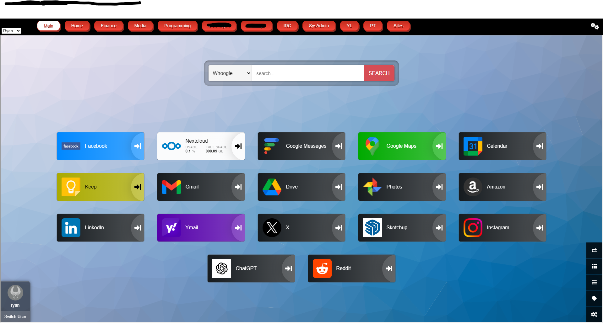
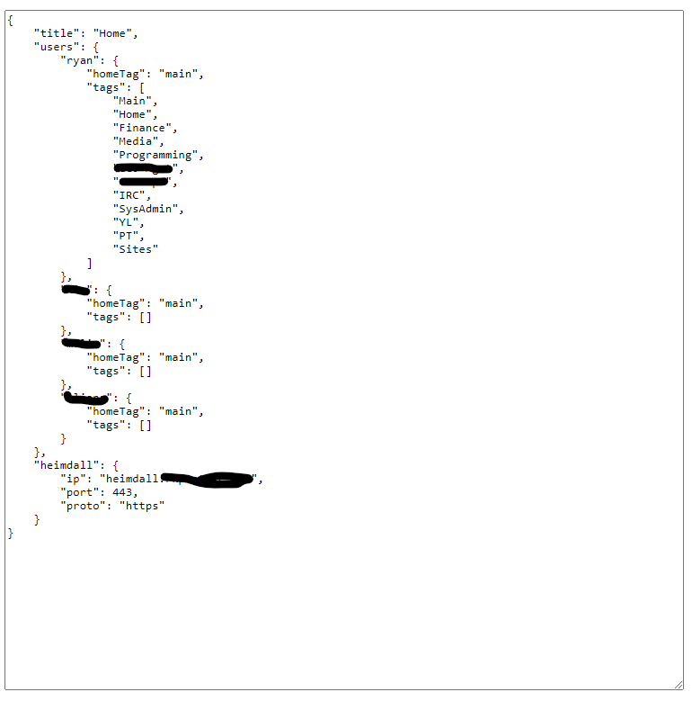

# Heimdall Wrapper

Heimdall Wrapper is intended to wrap a Heimdall instance to provide paged links for a more user friendly experience.



## Install

### Clone the repo

Clone the repository

`git clone https://github.com/godsgood33/heimdall-wrapper.git`

### Update config file in `./app/config/conf.example.json`

Rename the file to `conf.json` and update users add as many users as you have in your Heimdall instance.  Update the "homeTag" as the default tag you want to see when navigating to the page.  Update the "tags" array with all the tags that you will you to display at the top of the page, each tag has to correspond to a tag in Heimdall.  You can add as many as you like, but you'll it can only safely show about 15 tags across a 27" 1080p monitor

Update the "heimdall" section of the JSON with the IP/Hostname (has to be accessible in the context you at trying to access it from), the PORT (integer), and the PROTO (delete one of the two).  If you're using the `docker-compose-with-heimdall.yml` file you can leave it like it is and it will work.



### Choose docker-compose file

If you want to install there are two docker-compose files so you can select if you want to install a fresh Heimdall instance rename `docker-compose-with-heimdall.yml` to `docker-compose.yml`.  If you already have a Heimdall instance and just want the wrapper, rename with `docker-compose-without-heimdall.yml`.

### Run docker-compose

Run the docker compose to start download your containers and start Heimdall

```
docker-compose up -d
```

### Visit on Browser

Open your browser and navigate to the IP and port of the Heimdall-Wrapper.